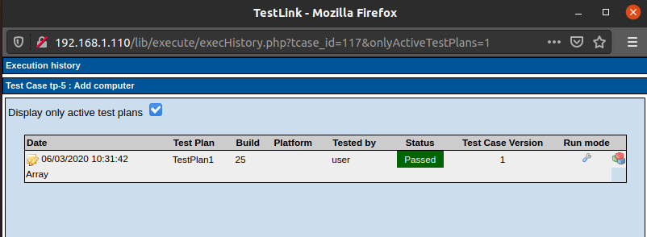

# Projekt Freestyle
Projekt można by skonfigurować w zwykłym pipeline, wykorzystując kod z poprzednich laboratoriów i wysyłając wyniki testów do Testlinka dokładnie w taki sam sposób, tylko że tym razem wywołując skrypt z poziomu Jenkinsa.
Postanowiłem skonfigurować go w projekcie typu *freestyle*, w którym można wykorzystać jenkinsowy plugin testlink.
## Konfiguracja krokow w Jenkinsie
Ważnym elementem było dodanie odpowiednich custom field'ów przy konfiguracji w Jenkinsie

## Konfiguracja test case'ow w Testlinku
I odpowiednio w Testlinku:

## Wykonane testy w Jenkinsie
Poniżej prezentuje historię egzekucji poszczególnych testów. Zostały wykonane z użyciem Selenium WebDrive'ra.

## Rezultaty w Testlinku

### 1 test

### 2 test

### 3 test

### 4 test

